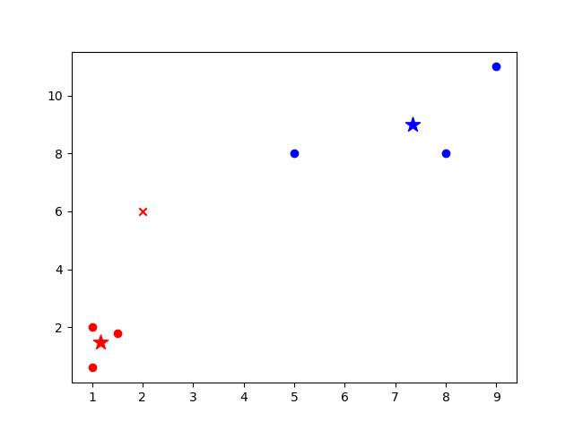

# zkML

## Description

Using Leo in machine learning training and prediction, Enabling machine learning algorithms can be run while protecting private data.

## Directory structure

- algorithm: The basic algorithm in the training process
  - decTreeGini: The Gini coefficient is calculated in the decision tree
- decision_tree: Decision tree algorithm and python generated Leo code
  - classify: Decision tree prediction Leo code file
- k_means: K-Means algorithm and python generated Leo code
  - kMeans: K-Means prediction  Leo code file

## Build guide

- Python 3.7+
- Anaconda
- Leo for Visual Studio Code 0.16.0

## Usage

```shell
# clone repository 
git clone https://github.com/storswiftlabs/zkML.git

# Gini coefficient calculate
cd zkML/algorithm/decTreeGini
leo run com_gini 

cd zkML/decision_tree
# execte decision tree python algorithm
python dt.py
# use python generated Leo code(decision tree)
python ./generate_dt_leo.py
# run Decision tree prediction Leo code
cd ./classify
leo run main

cd zkML/k_means
# execte k-Means python algorithm
python k_means.py
# use python generated Leo code(k-Means)
python ./generate_k_means_leo.py
# run k-Means prediction Leo code
cd ./kMeans
leo run main
```


## Visualization

ML model visualization in python

### decision tree


### k-Means



"×" means the newly added prediction point

"★" means the center points

"·" means the training points

## Notes

If you have your own decision tree or k-Means configuration, you can modify the following in python.

- The decision tree modifies the following:

```python
# dataset and label corresponded one by one, 0 was false, 1 was true,  and the decision tree was represented by dict
dataset = [0, 0]
tree: dict = {'label': 'haveHouse',0: {'label': 'haveJob', 0: 0, 1: 1}, 1: 1}
label = ['haveHouse', 'haveJob']
```

- The k-Means modifies the following:

```
dataset = [2,6] # New point to be predicted
centers = [[1.167,1.467], [7.333, 9]] # Each central point cluster
```

